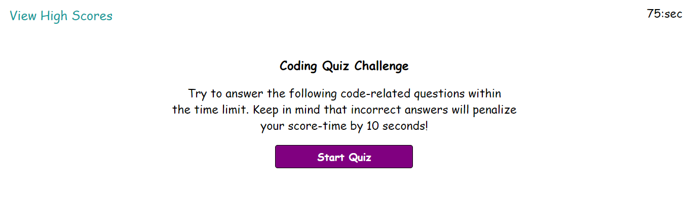

# codersTimedChallenge

## Table of Contents 

* [Installation](#installation)
* [Html changes](#html-changes)
* [CSS changes](#css-changes)
* [JavaScript changes](#javascript-changes)
* [Link to site](#link-to-site)
* [Screenshot](#screenshot-of-landing-page)
* [Credits](#credits)
* [License](#license)

I built this timed quiz on JavaScript fundamentals so as to provide a way to guage my progress compared to my peers. This quiz allows my peers and I the opportunity to take a 5 question timed quiz on JavaScript fundamentals and give us our score at the end. Score is based on the time left and if you miss a question it is marked as wrong and will deduct 10 seconds for each wrong answer. Each question you answer before the quiz automaticlly goes to the next question it will tell you at the bottom of the page with a promt of wrong or correct. At the end of the quiz you will be prompted to enter your initials and then when submitted will put you on a score list. You can then keep track of the scores so at the end to see who did the best; once done all the scores can be deleted and you can start all over. 

## Installation

Click the link to site in this README and it will take you to the landing page for the site. 

## Html changes

// Html changes //

Made a HTML layout for a 5 question quiz with a start page, final score page, and high score page; any changes in the future will be updated here...

## CSS changes
/* CSS changes */ 

Initial styles for layout, buttons, and mobile usage; any changes in the future will be updated here...

## JavaScript Changes

JavaScrpit was madeup to provide an interative and timed 5 question quiz with the ability to check answers for right and wrong while also deducting time for wrong answers and moving to the next question. At the end of the quiz it stores scores and user information for recall and also allows the information to be deleted when called for.

## Link to site

https://lewisoutdoorllc.github.io/codersTimedChallenge/

## Screenshot of landing page

## Credits

Thanks for all the help from Kip and other classmates on this little venture for making this happen.. Always fun!! Cheers..

//  Links that helped get to the proper conclusion for providing the solutions to our users requirements..

## License

Copyright (c) 2012-2020 Scott Chacon and others

Permission is hereby granted, free of charge, to any person obtaining
a copy of this software and associated documentation files (the
"Software"), to deal in the Software without restriction, including
without limitation the rights to use, copy, modify, merge, publish,
distribute, sublicense, and/or sell copies of the Software, and to
permit persons to whom the Software is furnished to do so, subject to
the following conditions:

The above copyright notice and this permission notice shall be
included in all copies or substantial portions of the Software.

THE SOFTWARE IS PROVIDED "AS IS", WITHOUT WARRANTY OF ANY KIND,
EXPRESS OR IMPLIED, INCLUDING BUT NOT LIMITED TO THE WARRANTIES OF
MERCHANTABILITY, FITNESS FOR A PARTICULAR PURPOSE AND
NONINFRINGEMENT. IN NO EVENT SHALL THE AUTHORS OR COPYRIGHT HOLDERS BE
LIABLE FOR ANY CLAIM, DAMAGES OR OTHER LIABILITY, WHETHER IN AN ACTION
OF CONTRACT, TORT OR OTHERWISE, ARISING FROM, OUT OF OR IN CONNECTION
WITH THE SOFTWARE OR THE USE OR OTHER DEALINGS IN THE SOFTWARE.